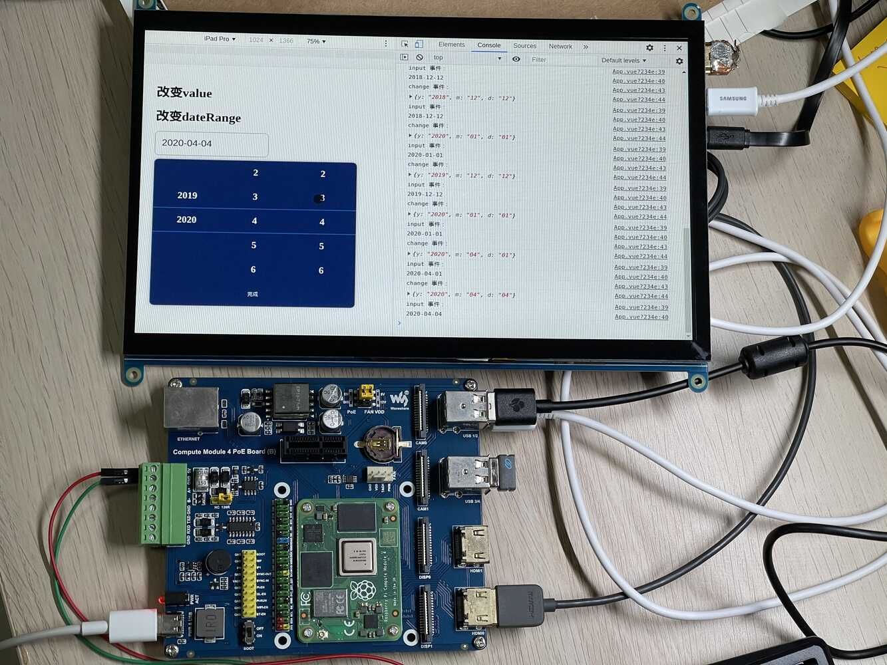

# pad-date-select

---

*这不是一个通用组件*   
东家项目需要，赶工写的一个日期滚动选择组件，兼容移动端和pc端的拖动选择。      
实现了橡皮筋效果、惯性效果。

---

示例展示：

1. pc端浏览器展示：
    
   
2. pad端触屏展示：    
视频点[这里](https://www.bilibili.com/video/BV1334y197ev/)      

